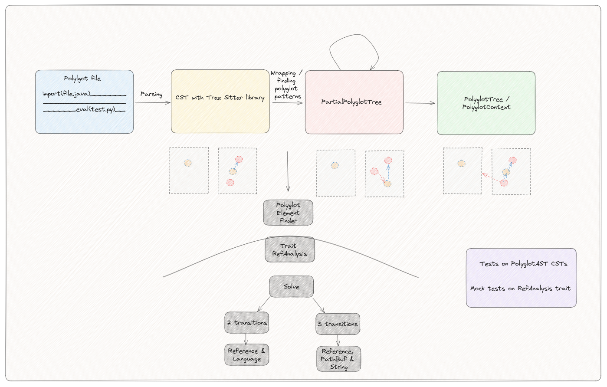
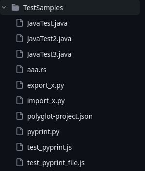
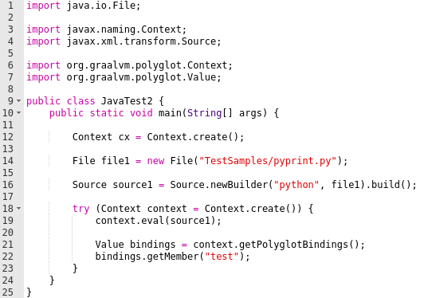
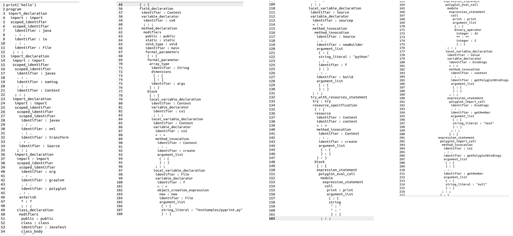

# Polyglot AST

## 💻 Presentation

**Rust implementation of a polyglot (cross-language) Abstract Syntax Tree (AST) framework.**

**This repository contains tools to build polyglot ASTs from source code of GraalVM applications. 
It currently supports java, javascript and python, and is built in a manner that aims to facilitate addition of new languages.**

## 🔨 Architecture

There is one class per language in the building folder. Each class contains functions to build the AST of a file in the language.
If you want want to add a new language, you just have to add a new class in the building folder.

## 📝 Running

You choose directly the polyglot file you want to run (here JavaTest2.java) in the main class main.rs.

After that, you just have to run the project from this main class.

For example, you can call a polyglot file, here JavaTest2.java, which is directly located in the test folder (here TestSamples).

  
  

### 📌 Example AST result

Once you have runned the project, you get the polyglot AST of the file:

